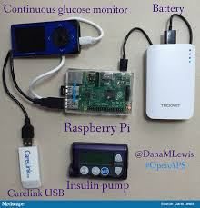
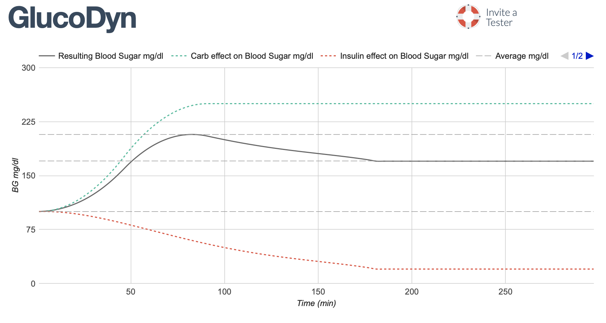
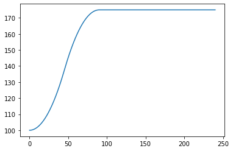
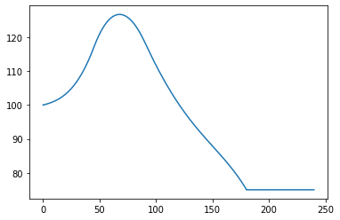
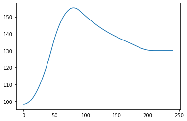

# Relatório Intermediário de Iniciação Tecnológica


   O diabetes tipo 1 é uma doença autoimune na qual o sistema imunológico da pessoa ataca de forma equivocada as células betas do pâncreas, sendo essas células responsáveis pela produção do hormônio da insulina. A diminuição da secreção desse hormônio afeta a glicose sanguínea da pessoa por ser responsável pelo metabolismo dos carboidratos.
   Uma pessoa pode desenvolver diabetes tipo 1 em qualquer idade, pelo fato de ser uma doença genética. O tratamento é feito através da aplicação de insulina exógena. Dessa forma, a pessoa aplica uma quantidade de insulina relativa ao seu metabolismo, e outras aplicações referentes a sua alimentação, levando em conta quantidade de carboidrato ingeridos.
    Hoje as soluções passam por sensores de glicemia contínuos e bombas de insulina que agem de forma independentes. O paciente é o controlador deste sistema, tendo o sensor e o atuador(bomba de insulina) como as ferramentas para tomar sua decisão. Existindo apenas uma bomba no mundo aprovada para ser um controlador do sistema, ou seja, ler a glicemia e decidir quanto de insulina deve-se aplicar, muitas pessoas envolvidas neste meio buscaram uma solução que não depende-se de grandes indústrias farmacêuticas. Assim, nasceram muitos sistemas Open-Source que conseguiram brechas nas tecnológias atuais e fecharam o ciclo. O paciente ainda precisa realizar aplicações relacionadas as refeições mas quando se fala de insulina basal(referente ao metabolismo) o sistema consegue agir sem intervenção humana. A questão que essa iniciação pretende abordar está em um sistema hardware-in-the-loop que possa simular o corpo humano para uma rotina de teste mais eficiente desses softwares.
    Dessa forma, como primeiro objetivo do trabalho foi entender como esses sistemas funcionam e qual deles seria interessante de se utilizar nas simulações. São muitas variantes destes sistemas disponíveis. Entre eles existem o OpenAPS, AndroidAPS e o Loop. O precursor de todos, o OpenAPS é o único que roda em uma placa eletrônica, diferente dos outros que rodam no sistema operacional de celulares. Dessa forma foi decidido utilizar o OpenAPS como o sistema Open-Source de controle de diabetes para usufruir do nosso simulador como corpo humano.




# Primeiro modelo

Para o primeiro modelo, foi encontrado um simulador de diabetes tipo 1 chamado GlucoDyn. O objetivo dele é ajudar pessoas recentemente diagnosticadas a entender melhor o funcionamento da glicemia junto com alimentação e aplicação de insulina.



Para começar nosso modelo, foi realizada uma adaptação do modelo do GlucoDyn para Python com o objetivo de conseguir trabalhar melhor com as simulações, porém podendo usar o próprio GlucoDyn como validação.
O software trabalha em loop, onde os itens de um lista se tratam de cada momento no futuro. Dessa forma ingerir um alimento ou aplicar uma dose de insulina possuem seus efeitos ao longo do tempo afetando cada momento futuro de uma forma diferente.

## Funções implementadas no modelo

### Funções bases

A função IOB trata do termo Insulin on board. Dessa forma, ela é responsável por calcular a quantidade de insulina ativa no paciente baseando-se no tempo que a aplicação ocorreu e o tipo de insulina que foi utilizada. O tipo de insulina é referente ao tempo de ação da insulina, que é descrito pelas curvas do modelo de Walsh de insulina. (falta falar qual é o retorno da função)


```python
def IOB(bolustime,insulindur):
    if(bolustime<=0.0):
        tot=100.0
    elif (bolustime>=insulindur*60.0):
        tot=0.0
    else:
        if(insulindur==3):
            tot=-3.203e-7*math.pow(bolustime,4)+1.354e-4*math.pow(bolustime,3)-1.759e-2*math.pow(bolustime,2)+9.255e-2*bolustime+99.951
        elif (insulindur==4):
            tot=-3.31e-8*math.pow(bolustime,4)+2.53e-5*math.pow(bolustime,3)-5.51e-3*math.pow(bolustime,2)-9.086e-2*bolustime+99.95
        elif (insulindur==5):
            tot=-2.95e-8*math.pow(bolustime,4)+2.32e-5*math.pow(bolustime,3)-5.55e-3*math.pow(bolustime,2)+4.49e-2*bolustime+99.3
        elif (insulindur==6):
            tot=-1.493e-8*math.pow(bolustime,4)+1.413e-5*math.pow(bolustime,3)-4.095e-3*math.pow(bolustime,2)+6.365e-2*bolustime+99.7
    return tot
```

A função intIOB trata da integração da quantidade de insulina ativa no paciente. Esse é um cálculo estretamente necessário quando se fala de uma alteração da insulina basal do paciente. Diferente do IOB que trata de uma aplicação de insulina momentânea do paciente, o intIOB irá se referir a um aumento ou diminuição da taxa de insulina basal padrão daquele paciente. Dessa forma é necessário integrar está taxa para encontrar a real quantidade de insulina a mais ou a menos que foi aplicada e poder entender como isso afetará os momentos futuros. A integral é realizada a partir do teorema de Simpson.


```python
def intIOB(x1,x2,insulindur,bolustime):

    nn=50
    ii=1

    
    dx=(x2-x1)/nn
    intebolustimeral=IOB((bolustime-x1),insulindur)+IOB(bolustime-(x1+nn*dx),insulindur)
    integral=0
    while(ii<nn-2):
        integral = integral + 4*IOB(bolustime-(x1+ii*dx),insulindur)+2*IOB(bolustime-(x1+(ii+1)*dx),insulindur)
        ii=ii+2

    integral=integral*dx/3.0
    return(integral)
```

Na última função base do modelo temos o COB(carbs on board), que trata da quantidade de carboidrato ainda não metabolizado(conferir se é isso mesmo) no organismo do paciente. Assim como a função IOB, é necessário saber a quanto tempo foi ingerido esse carboidrato e o tempo de absorção deste tipo, que varia de alimento pra alimento.


```python
def cob(bolustime,carbtype):

    if(bolustime<=0):
        tot=0.0
    elif (bolustime>=carbtype):
        tot=1.0
    elif ((bolustime>0) and (bolustime<=carbtype/2.0)):
        tot=2.0/math.pow(carbtype,2)*math.pow(bolustime,2)
    else:
        tot=-1.0+4.0/carbtype*(bolustime-math.pow(bolustime,2)/(2.0*carbtype))
    return(tot)
```

### Funções delta

As funções delta se referem a influência dos fatores tratados nas funções bases diretamente na glicemia do paciente. O objetivo delas é juntar os atributos individuais do paciente junto com os valores temporários tratados nas funções bases para poder chegar a um valor de glicemia em cada instante, sendo isso visível em gráficos.

A função deltaBGC cálcula o efeito do carboidrato ingerido na glicemia do paciente, levando em conta os valores da COB e também a sensibilidade a insulina e a proporção carboidrato/insulina do paciente.


```python
def deltaBGC(bolustime,sensf,carbratio,carbamount,carbtype):
    return sensf/carbratio*carbamount*cob(bolustime,carbtype)

```

A função deltaBGI cálcula o efeito da insulina aplicada na glicemia do paciente, levando em conta os valores da IOB e também a sensibilidade a insulina do paciente.


```python
def deltaBGI(bolustime,bolus,sensf,insulindur):
    return -bolus*sensf*(1-IOB(bolustime,insulindur)/100.0)
```

A função dealtatempBGI se utiliza da função base intIOB para cálcular o efeito do basal temporário da glicemia do paciente, levando em conta os mesmos fatores do deltaBGI mais a taxa basal padrão do paciente naquele momento.


```python
def deltatempBGI(bolustime,dbdt,sensf,insulindur,t1,t2):
    return -dbdt*sensf*((t2-t1)-1/100*intIOB(t1,t2,insulindur,bolustime))
```

## Demonstrações do modelo

Para demonstração foi necessário definir alguns parâmetros. A sensibilidade de insulina do paciente é 50 mg/dL e a proporção carboidrato insulina é 20g/U. O tempo de simulação foi de 3600 segundos, ou seja, 1 hora. O dt é o qual o valor de tempo de cada momento. Logo sendo dt = 0.1, em 3600 segundos teremos 36000 momentos no gráfico, equivalente a variável n. Também foi colocado o valor inicial de glicemia em 100 mg/dL. 


```python
from funcs import *
import matplotlib.pyplot as plt
import numpy as np
sens = 50
carbratio = 20
simlengthseg = 3600
dt = 0.1
n = simlengthseg / dt
temp = np.arange(0,simlengthseg,dt)

initialBG = 100
simbg = [initialBG]*int(n)
G = [0.0]*int(n)
```

### Simulação Carboidrato


```python
AT=int(240/dt)
for t in range (0, AT):
    G[t] = deltaBGC(t, sens, carbratio, 30, int(90/dt) ) + simbg[t]
plt.plot(temp[0:AT],G[0:AT])
```


    [<matplotlib.lines.Line2D at 0x11e48eb70>]





### Simulação Carboidrato + Insulina


```python
AT=int(240/dt)
for t in range (0, AT):
    G[t] = deltaBGC(t, sens, carbratio, 30, int(90/dt) ) + deltaBGI(t*dt, 2, sens, 3) + simbg[t]
plt.plot(temp[0:AT],G[0:AT])    
```


    [<matplotlib.lines.Line2D at 0x11e704390>]





### Simulação Carboidrato + Basal Temporário


```python
AT=int(240/dt)
for t in range (0, AT):
    G[t] = deltaBGC(t, sens, carbratio, 30, int(90/dt) ) + deltatempBGI(t*dt,0.03,sens,3,0,30) + simbg[t]
plt.plot(temp[0:AT],G[0:AT])    
```


    [<matplotlib.lines.Line2D at 0x11e5ef0b8>]




